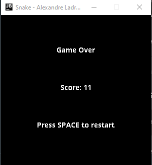

# Snake


[](https://github.com/AlexandreLadriere/Snake/blob/master/LICENSE)

Minimalist "Snake" game in Java
<div align="center">
 
 
</div>

## Controls
- ``Right arrow``: Move right
- ``Left arrow``: Move left
- ``Up arrow``: Move up
- ``Down arrow``: Move down
- ``Q``: Quit
- ``SPACE``: Restart

## How to use
You can compile and run this app by yourself OR you can use my [make.sh] script:
#### Build all .class files
```shell script
$ sh make.sh build
```

#### Run the app
```shell script
$ sh make.sh run
```

#### Build JAR file
```shell script
$ sh make.sh build-jar
```

#### Clean
```shell script
$ sh make.sh clean
```

## License
This project is licensed under the MIT License - see the [LICENSE] file for details.

## Contributing
Contributions are welcome :smile:

### Pull requests
Just a few guidelines:
-   Write clean code with appropriate comments and add suitable error handling.
-   Test the application and make sure no bugs/ issues come up.
-   Open a pull request and I will be happy to acknowledge your contribution after some checking from my side.

### Issues
If you find any bugs/issues, raise an issue.

  [LICENSE]: <LICENSE>
  [make.sh]: <make.sh>